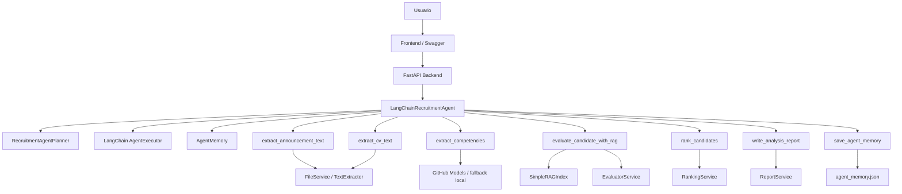

# Orquestación del agente LangChain

## 1. Objetivo del agente

El proyecto incorpora un agente de preselección documental orientado al análisis de anuncios laborales y CV. Su objetivo es coordinar el flujo completo de evaluación de candidatos, utilizando herramientas de consulta, razonamiento, escritura y memoria.

El agente no reemplaza la decisión humana. Su función es apoyar la preselección mediante evidencia textual recuperada desde los CV y criterios derivados del anuncio laboral.

---

## 2. Framework utilizado

La implementación utiliza LangChain como framework de agentes, siguiendo el enfoque revisado en RA2:

* `ChatOpenAI`
* herramientas LangChain
* `create_openai_tools_agent`
* `AgentExecutor`

El agente se implementa en:

```text
app/backend/app/agents/langchain_recruitment_agent.py
```

Las herramientas se declaran en:

```text
app/backend/app/agents/langchain_tools.py
```

La memoria del agente se implementa en:

```text
app/backend/app/agents/agent_memory.py
```

El plan determinístico del agente se define en:

```text
app/backend/app/agents/agent_planner.py
```

---

## 3. Arquitectura general



---

## 4. Endpoints del agente

El flujo clásico se mantiene disponible:

```text
POST /api/analyze
POST /api/analyze/start
GET  /api/analyze/status/{job_id}
GET  /api/analyze/result/{job_id}
```

El nuevo flujo con agente LangChain se expone mediante:

```text
POST /api/agent/analyze
POST /api/agent/analyze/start
GET  /api/agent/analyze/status/{job_id}
GET  /api/agent/analyze/result/{job_id}
```

Esto permite comparar el pipeline original con la versión orquestada por agente.

---

## 5. Herramientas del agente

El agente declara herramientas formales con `StructuredTool` de LangChain.

| Herramienta                   | Tipo                    | Responsabilidad                                                    |
| ----------------------------- | ----------------------- | ------------------------------------------------------------------ |
| `extract_announcement_text`   | Consulta                | Obtiene el texto del anuncio laboral desde texto manual o archivo. |
| `extract_cv_text`             | Consulta                | Extrae texto de un CV seleccionado.                                |
| `extract_competencies`        | Razonamiento            | Deduce competencias laborales desde el anuncio.                    |
| `evaluate_candidate_with_rag` | Consulta + razonamiento | Construye índice RAG, recupera evidencia y evalúa al candidato.    |
| `rank_candidates`             | Razonamiento/cálculo    | Ordena candidatos y genera la terna recomendada.                   |
| `write_analysis_report`       | Escritura               | Genera reportes Markdown y JSON.                                   |
| `save_agent_memory`           | Memoria                 | Persiste el resumen de la sesión del agente.                       |

---

## 6. Planificación del agente

El agente utiliza dos niveles de planificación.

### 6.1 Plan determinístico

El archivo `agent_planner.py` define un plan base auditable:

1. Preparar anuncio laboral.
2. Extraer competencias.
3. Evaluar candidatos con RAG.
4. Generar ranking.
5. Escribir reporte.
6. Guardar memoria.

Este plan asegura estabilidad en el flujo de negocio.

### 6.2 Planificación con LangChain

Además del plan determinístico, el agente ejecuta una etapa de planificación con LangChain mediante:

```text
create_openai_tools_agent
AgentExecutor
```

Esta etapa genera una planificación técnica del uso de herramientas, que queda registrada en:

```text
agent_trace.planning_output
```

---

## 7. Decisiones adaptativas

El agente registra decisiones según las condiciones de entrada.

Ejemplos:

| Condición                                   | Decisión                                      |
| ------------------------------------------- | --------------------------------------------- |
| El usuario entrega texto manual del anuncio | Usar texto manual y omitir OCR.               |
| No se entrega texto manual                  | Extraer texto desde el archivo del anuncio.   |
| Hay menos de tres CV                        | Generar terna parcial.                        |
| Hay tres o más CV                           | Generar terna completa.                       |
| Existe un anuncio seleccionado              | Registrar fuente del anuncio.                 |
| Falla la planificación LLM                  | Continuar con plan determinístico controlado. |

Estas decisiones quedan registradas en:

```text
agent_trace.memory.short_term_memory.decisions
```

---

## 8. Memoria del agente

El agente utiliza dos tipos de memoria.

### 8.1 Memoria de corto plazo

Se mantiene durante la ejecución actual e incluye:

* pasos ejecutados;
* decisiones tomadas;
* herramientas invocadas;
* contexto recuperado;
* resumen final.

Se expone en la respuesta dentro de:

```text
agent_trace.memory.short_term_memory
```

### 8.2 Memoria de largo plazo

La memoria persistente se guarda en formato JSON en:

```text
app/backend/outputs/memory/agent_memory.json
```

Permite mantener historial de sesiones de análisis.

---

## 9. Recuperación semántica con RAG

El agente reutiliza el componente RAG ya existente en la aplicación.

El flujo por candidato es:

1. Extraer texto del CV.
2. Crear un índice `SimpleRAGIndex`.
3. Buscar fragmentos relevantes por competencia.
4. Entregar evidencia recuperada al evaluador.
5. Calcular puntaje y recomendación.

Esto permite justificar cada evaluación con fragmentos textuales del CV.

---

## 10. Ejemplo de request

```json
{
  "announcement_id": "anuncio2",
  "cv_ids": [
    "cv_2023_-_fabián_lecaros",
    "cv_alvaro_morales_sso"
  ],
  "announcement_text_override": "Se requiere profesional con experiencia en recursos humanos, revisión documental, entrevistas, manejo de Excel, elaboración de reportes y comunicación efectiva.",
  "terna_size": 3,
  "selected_model": null
}
```

---

## 11. Evidencia esperada en la respuesta

Una respuesta correcta del endpoint del agente debe incluir:

```json
{
  "progress_log": [
    "Agente LangChain: preparando anuncio laboral...",
    "Agente LangChain: deduciendo competencias..."
  ],
  "agent_trace": {
    "framework": "LangChain",
    "agent_type": "openai_tools_agent",
    "execution_mode": "langchain_planned_controlled_execution",
    "tools": [],
    "plan": [],
    "planning_output": "...",
    "memory": {}
  }
}
```

La presencia de `agent_trace` permite evidenciar:

* framework utilizado;
* herramientas declaradas;
* planificación;
* memoria;
* decisiones adaptativas;
* trazabilidad de ejecución.

---

## 12. Consideraciones éticas

El sistema debe ser usado como apoyo documental, no como sustituto de la decisión humana.

Se recomienda:

* evitar el uso de datos sensibles;
* no considerar edad, género, nacionalidad, fotografía, estado civil o información familiar;
* basar las recomendaciones solo en evidencia laboral textual;
* mantener revisión humana sobre la terna final;
* documentar limitaciones y posibles sesgos.

---

## 13. Relación con los indicadores de evaluación

| Indicador | Cumplimiento                                                                   |
| --------- | ------------------------------------------------------------------------------ |
| IE1       | El agente integra herramientas de consulta, razonamiento, escritura y memoria. |
| IE2       | Se usa LangChain como framework específico de agentes.                         |
| IE3       | Se implementa memoria de corto y largo plazo.                                  |
| IE4       | Se reutiliza RAG para recuperación semántica desde CV.                         |
| IE5       | Existe planificación determinística y planificación con LangChain.             |
| IE6       | El agente toma decisiones adaptativas según condiciones del flujo.             |
| IE7       | La arquitectura queda documentada con diagrama y endpoints.                    |
| IE8       | Se justifican componentes, herramientas y decisiones técnicas.                 |
| IE9       | La implementación genera evidencia trazable en JSON y Markdown.                |
| IE10      | El resultado usa lenguaje técnico y auditable.                                 |
