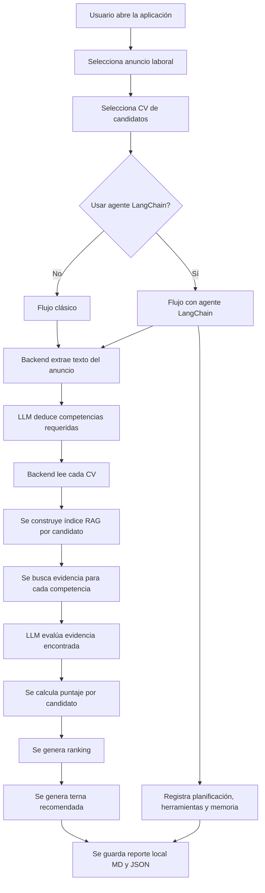
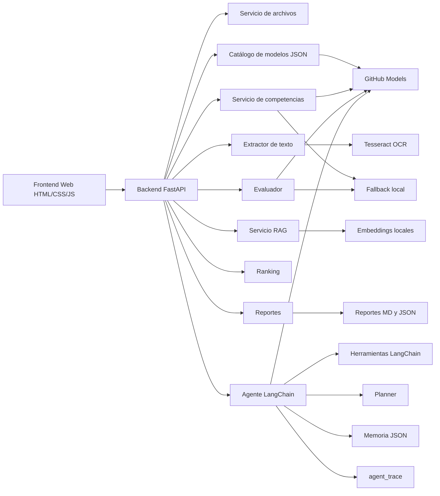
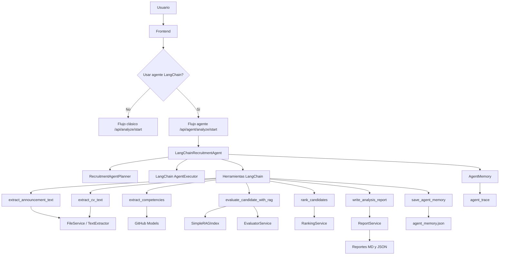

# Caso 3 - Aplicación RAG para evaluación de candidatos por competencias

## 1. Resumen del proyecto

Este proyecto consiste en una aplicación web sencilla que apoya el proceso de preselección de candidatos para **Salmones Camanchaca S.A.**, empresa del rubro salmonero en Chile.

La aplicación permite seleccionar un **anuncio laboral** y uno o más **CV de candidatos**. Luego, mediante IA generativa y RAG, el sistema deduce las competencias requeridas por el cargo, revisa los CV seleccionados, evalúa la evidencia encontrada y genera un **ranking de candidatos**, junto con una **terna recomendada**.

Además del flujo clásico de análisis, la aplicación incorpora un **flujo alternativo basado en agente LangChain**. Este agente coordina el proceso mediante herramientas de consulta, razonamiento, escritura, memoria y planificación, manteniendo trazabilidad técnica de la ejecución.

El sistema no reemplaza la decisión humana del área de Talento o Recursos Humanos. Su objetivo es servir como una herramienta de apoyo para ordenar, comparar y justificar una preselección documental de candidatos.

La aplicación fue pensada de forma general: puede trabajar con distintos anuncios laborales, no solo con un cargo específico. Las competencias no están escritas previamente en el código, sino que se deducen desde el texto del anuncio seleccionado.

---

## 2. Contexto organizacional

La organización utilizada como contexto es **Salmones Camanchaca S.A.**, empresa chilena vinculada a la industria salmonera.

En este tipo de empresa existen procesos de contratación para cargos técnicos, administrativos, operativos y profesionales. Muchos de estos cargos requieren revisar antecedentes como:

- formación académica;
- experiencia laboral;
- conocimientos técnicos;
- certificaciones;
- disponibilidad para terreno o turnos;
- habilidades transversales;
- cumplimiento de requisitos formales.

El proceso de revisión de CV puede consumir bastante tiempo, especialmente cuando existen varios candidatos para un mismo anuncio. Además, puede ser difícil justificar de manera clara por qué ciertos postulantes pasan a una terna y otros no.

Por eso, la aplicación busca apoyar la etapa inicial de revisión documental mediante un análisis por competencias basado en evidencia.

---

## 3. Problema que resuelve

En un proceso tradicional de reclutamiento, el equipo de talento debe revisar manualmente cada anuncio y cada CV. Esto puede generar varios problemas:

- demora en la revisión inicial de postulantes;
- diferencias de criterio entre evaluadores;
- dificultad para justificar por qué un candidato fue priorizado;
- revisión repetitiva de documentos extensos;
- riesgo de considerar información no pertinente;
- baja trazabilidad de la evaluación inicial.

La solución propuesta busca apoyar esta etapa mediante una aplicación que revise los documentos y entregue una recomendación preliminar basada en evidencia documental.

---

## 4. Objetivo general

Desarrollar un prototipo de aplicación basada en **IA generativa, RAG y agentes inteligentes** que permita analizar anuncios laborales de una empresa salmonera, deducir competencias requeridas, evaluar CV de candidatos y generar una terna recomendada con justificación documental.

---

## 5. Objetivos específicos

- Permitir la selección de un anuncio laboral desde el frontend.
- Permitir la selección de uno o más CV disponibles.
- Permitir la selección del modelo LLM desde una lista desplegable cargada desde `github_models.json`.
- Extraer el texto del anuncio laboral, incluso cuando esté en imagen mediante OCR.
- Extraer el texto de los CV en PDF.
- Deducir automáticamente las competencias requeridas desde el anuncio.
- Buscar evidencia en cada CV mediante un proceso RAG.
- Evaluar cada candidato en función de las competencias detectadas.
- Generar un ranking y una terna recomendada.
- Mostrar una barra de progreso con trazabilidad del análisis.
- Registrar si se usó LLM, fallback local o si ocurrió algún error.
- Generar un reporte local en formato Markdown y JSON.
- Incorporar un flujo alternativo basado en agente LangChain.
- Declarar herramientas de consulta, razonamiento, escritura y memoria para el agente.
- Registrar la planificación, decisiones adaptativas, herramientas ejecutadas y memoria del agente.
- Permitir comparar el flujo clásico con el flujo orquestado por agente.

---

## 6. Cómo cumple con la pauta de la EP1

El proyecto cumple con los principales elementos esperados para una entrega inicial de solución basada en IA generativa, ya que presenta un caso organizacional concreto, una problemática clara, una arquitectura funcional y un prototipo demostrable.

| Elemento esperado | Cómo se cumple en el proyecto |
|---|---|
| Organización seleccionada | Se trabaja con Salmones Camanchaca S.A., empresa del rubro salmonero. |
| Problema o desafío | Se aborda la revisión documental de postulantes y la preselección de candidatos. |
| Motivación para usar IA | La IA permite analizar texto no estructurado presente en anuncios y CV. |
| Uso de LLM | Se utiliza un modelo de GitHub Models para deducir competencias y evaluar evidencia. |
| Uso de RAG | Se recuperan fragmentos relevantes de los CV antes de evaluar al candidato. |
| Uso de agente | Se incorpora un flujo alternativo con agente LangChain, herramientas, planificación y memoria. |
| Prompts | El sistema utiliza instrucciones para extracción de competencias, evaluación por evidencia y planificación del agente. |
| Arquitectura | Se implementa frontend, backend, servicios internos, RAG, LLM, fallback, agente y generación de reportes. |
| Evidencia de funcionamiento | La app muestra progreso, llamadas exitosas al LLM, ranking, terna, reportes locales y trazabilidad del agente. |
| Consideraciones éticas | Se evita usar edad, género, nacionalidad, fotografía, estado civil u otros datos sensibles. |

---

## 7. Explicación simple de IA generativa, RAG y agente

### 7.1 IA generativa

La IA generativa se usa para interpretar lenguaje natural. En este proyecto responde preguntas como:

- ¿Qué competencias exige este anuncio laboral?
- ¿El CV del candidato evidencia esta competencia?
- ¿Qué justificación se puede entregar a partir de la evidencia encontrada?

### 7.2 RAG

RAG significa **Retrieval-Augmented Generation**, o generación aumentada con recuperación de información.

En palabras simples, RAG funciona así:

1. Se divide el CV en fragmentos pequeños.
2. El sistema busca los fragmentos más relacionados con una competencia.
3. Esos fragmentos se entregan al modelo de IA.
4. El modelo responde usando la evidencia recuperada.

Esto reduce el riesgo de que la IA invente información, porque no se le pide responder desde memoria general, sino desde fragmentos concretos del CV.

### 7.3 Agente LangChain

Un agente es una capa de software que organiza tareas, decide qué herramientas usar y registra su ejecución.

En este proyecto, el agente LangChain no reemplaza el pipeline original, sino que se agrega como **flujo alternativo**. Su función es coordinar el análisis usando herramientas formales para:

- consultar documentos;
- deducir competencias;
- evaluar candidatos con RAG;
- ordenar resultados;
- escribir reportes;
- guardar memoria;
- registrar trazabilidad.

---

## 8. Secuencia general de funcionamiento de la aplicación



---

## 9. Flujo paso a paso en lenguaje simple

### Paso 1: Selección del anuncio

El usuario selecciona un anuncio laboral desde la interfaz web. El anuncio puede estar en formato de imagen o puede ser ingresado manualmente como texto.

### Paso 2: Extracción del texto del anuncio

Si el anuncio está en imagen, la aplicación utiliza **Tesseract OCR** para convertir la imagen en texto. OCR significa reconocimiento óptico de caracteres. En simple, permite leer letras dentro de una imagen.

Si Tesseract no está disponible o el texto extraído no es correcto, el usuario puede pegar manualmente el texto del anuncio.

### Paso 3: Selección del modelo LLM

Antes de iniciar el análisis, el usuario puede seleccionar el modelo LLM que desea utilizar. La lista de modelos se carga desde el archivo:

```text
app/backend/app/data/github_models.json
```

El modelo marcado con `default: true` aparece como opción predeterminada. Si el usuario selecciona otro modelo, ese identificador se envía al backend para usarlo durante el análisis.

### Paso 4: Selección del flujo de análisis

El usuario puede ejecutar el flujo clásico o activar el flujo con agente mediante la opción:

```text
Usar agente LangChain
```

Si la opción está desmarcada, se ejecuta el pipeline clásico. Si está marcada, se ejecuta el agente LangChain, que coordina el proceso con herramientas, planificación, memoria y trazabilidad.

### Paso 5: Deducción de competencias

El texto del anuncio se envía al modelo LLM configurado en GitHub Models. El modelo puede venir desde la configuración base del archivo `.env` o desde el selector de modelo disponible en el frontend. El modelo deduce las competencias laborales que el cargo requiere.

Estas competencias pueden ser de distintos tipos, por ejemplo:

- competencias técnicas;
- experiencia requerida;
- formación académica;
- requisitos formales;
- competencias contextuales;
- competencias transversales.

Lo importante es que estas competencias **no están fijas en el código**. Se generan dinámicamente a partir del anuncio seleccionado.

### Paso 6: Selección de CV

El usuario selecciona uno o más CV disponibles. Cada CV está almacenado como PDF dentro del proyecto.

### Paso 7: Lectura de CV

El backend extrae el texto de cada PDF. Luego divide el texto en fragmentos más pequeños para facilitar la búsqueda de información relevante.

### Paso 8: Construcción del RAG

Para cada CV se crea un índice de búsqueda. Este índice permite encontrar fragmentos relacionados con cada competencia.

Por ejemplo, si la competencia es “manejo de herramientas de análisis de datos”, el sistema buscará dentro del CV frases relacionadas con Excel, Power BI, SQL, reportes, bases de datos u otras evidencias similares.

### Paso 9: Evaluación con LLM

Para cada candidato y cada competencia, el sistema envía al LLM:

- el nombre de la competencia;
- la evidencia recuperada desde el CV;
- una instrucción para evaluar solo con base en esa evidencia.

El modelo responde con un nivel, por ejemplo:

- no evidenciado;
- débil;
- parcial;
- claro;
- fuerte.

### Paso 10: Ranking

El backend transforma las evaluaciones en puntajes. Luego calcula un puntaje total para cada candidato según el peso de cada competencia.

### Paso 11: Terna recomendada

La aplicación selecciona los tres candidatos con mayor puntaje y genera una terna recomendada. Si se seleccionan menos de tres CV, el sistema genera una terna parcial.

### Paso 12: Reporte local

Al finalizar, la aplicación genera reportes en:

```text
app/backend/outputs/reports/
```

Los reportes se guardan en dos formatos:

- `.md`: reporte legible en Markdown;
- `.json`: resultado técnico completo.

Si se usa el flujo con agente, el resultado también incluye `agent_trace`, donde quedan registrados la planificación, herramientas, decisiones y memoria del agente.

---

## 10. Tecnologías utilizadas

La aplicación combina tecnologías de frontend, backend, procesamiento documental, RAG, IA generativa y agentes.

| Componente | Tecnología usada | Para qué se usa |
|---|---|---|
| Frontend | HTML | Estructura de la interfaz web. |
| Frontend | CSS | Estilos visuales, tarjetas, botones, barra de progreso, trazabilidad del agente y scroll de bitácora. |
| Frontend | JavaScript | Interacción con el usuario, llamadas al backend, actualización de progreso y visualización de resultados. |
| Backend | Python | Lenguaje principal del servidor. |
| Backend | FastAPI | Creación de API REST para conectar frontend y servicios internos. |
| Servidor local | Uvicorn | Ejecución del backend FastAPI en entorno local. |
| OCR | Tesseract OCR | Lectura de texto desde anuncios laborales en imagen. |
| OCR en Python | pytesseract | Conector entre Python y Tesseract. |
| Imágenes | Pillow | Apertura y procesamiento básico de imágenes antes del OCR. |
| PDF | PyMuPDF / fitz | Extracción de texto desde CV en PDF. |
| RAG / embeddings | Sentence Transformers | Generación de representaciones semánticas de los fragmentos de CV. |
| Cálculo vectorial | NumPy | Operaciones numéricas para comparar similitud entre textos. |
| LLM online | GitHub Models | Deducción de competencias y evaluación generativa de evidencia. |
| Agente IA | LangChain | Framework usado para declarar herramientas, planificar y orquestar el flujo alternativo del agente. |
| Agente IA | langchain-openai | Cliente compatible con OpenAI utilizado por LangChain para conectarse a GitHub Models mediante `base_url`. |
| Agente IA | StructuredTool | Declaración formal de herramientas de consulta, razonamiento, escritura y memoria. |
| Agente IA | AgentExecutor | Ejecución de la etapa de planificación del agente. |
| Memoria agente | JSON local | Persistencia de memoria de largo plazo en `outputs/memory/agent_memory.json`. |
| Variables de entorno | python-dotenv | Lectura de configuración desde archivo `.env`. |
| Configuración de modelos | JSON | Definición de modelos disponibles para el selector del frontend. |
| HTTP | requests | Comunicación del backend con GitHub Models. |
| Reportes | Markdown y JSON | Generación de reportes locales legibles y técnicos. |

---

## 11. Componentes de la aplicación

La aplicación está organizada de forma modular. Esto significa que cada archivo o servicio tiene una responsabilidad específica.

### 11.1 Frontend

Ubicación:

```text
app/frontend/
```

Archivos principales:

| Archivo | Tecnología | Función |
|---|---|---|
| `index.html` | HTML | Define la estructura visual de la página. |
| `styles.css` | CSS | Define colores, tamaños, tarjetas, botones, barra de progreso y visualización del agente. |
| `app.js` | JavaScript | Controla la interacción del usuario, carga archivos, inicia análisis, consulta progreso y renderiza trazabilidad. |

El frontend permite:

- seleccionar anuncio laboral;
- seleccionar CV;
- seleccionar el modelo LLM desde una lista desplegable;
- ver estado del modelo IA;
- iniciar análisis;
- elegir entre flujo clásico y flujo con agente LangChain;
- ver barra de progreso;
- revisar ranking y terna;
- abrir reportes generados;
- visualizar la trazabilidad del agente cuando se activa el flujo LangChain.

---

### 11.2 Backend

Ubicación:

```text
app/backend/
```

El backend está desarrollado con **FastAPI**. Su función es recibir solicitudes del frontend y coordinar todo el proceso de análisis.

Archivo principal:

| Archivo | Tecnología | Función |
|---|---|---|
| `main.py` | FastAPI | Define las rutas API y coordina el análisis completo. |

Principales rutas:

| Ruta | Función |
|---|---|
| `GET /` | Carga la aplicación web. |
| `GET /api/files` | Lista anuncios y CV disponibles. |
| `GET /api/models` | Lista los modelos disponibles definidos en `github_models.json`. |
| `GET /api/llm/status` | Indica si GitHub Models está activo y qué modelo se usa. |
| `GET /api/extract/announcement/{name}` | Extrae texto del anuncio. |
| `POST /api/analyze` | Ejecuta directamente el flujo clásico de análisis. |
| `POST /api/analyze/start` | Inicia un análisis clásico en segundo plano. |
| `GET /api/analyze/status/{job_id}` | Consulta el avance del análisis clásico. |
| `GET /api/analyze/result/{job_id}` | Obtiene el resultado final del análisis clásico. |
| `POST /api/agent/analyze` | Ejecuta directamente el análisis usando el agente LangChain. |
| `POST /api/agent/analyze/start` | Inicia un análisis con agente LangChain en segundo plano. |
| `GET /api/agent/analyze/status/{job_id}` | Consulta el avance del análisis ejecutado con agente. |
| `GET /api/agent/analyze/result/{job_id}` | Obtiene el resultado final del análisis ejecutado con agente. |

---

### 11.3 Servicio de archivos

Archivo:

```text
app/backend/app/services/file_service.py
```

Tecnología principal:

- Python estándar.

Este componente localiza los anuncios y CV dentro del proyecto.

Busca archivos en:

```text
resources/img/announcements/
resources/pdf/cv/
```

Su tarea es simple: decirle al frontend qué archivos existen y entregar sus rutas al backend.

---

### 11.4 Servicio de extracción de texto

Archivo:

```text
app/backend/app/services/text_extractor.py
```

Tecnologías utilizadas:

- PyMuPDF / fitz para leer PDFs;
- Tesseract OCR para reconocer texto en imágenes;
- pytesseract para llamar a Tesseract desde Python;
- Pillow para abrir imágenes.

Este componente convierte documentos en texto.

Hace dos trabajos:

- extrae texto desde CV en PDF;
- extrae texto desde imágenes de anuncios usando Tesseract OCR.

Si Tesseract no está disponible, el sistema permite pegar el texto manualmente.

---

### 11.5 Cliente LLM

Archivo:

```text
app/backend/app/services/llm_client.py
```

Tecnologías utilizadas:

- GitHub Models;
- requests;
- python-dotenv;
- JSON.

Este componente se comunica con GitHub Models.

Sus responsabilidades son:

- leer la configuración del archivo `.env`;
- llamar al modelo elegido;
- enviar prompts;
- recibir respuestas JSON;
- controlar pausas entre llamadas para evitar errores `429 Too Many Requests`;
- reintentar llamadas cuando el servicio responde con límite de solicitudes o error temporal;
- avisar si una llamada fue exitosa o falló.

Ejemplo de configuración:

```env
USE_LLM=true
GITHUB_TOKEN=tu_token
GITHUB_MODEL=openai/gpt-4o-mini
GITHUB_MODELS_ENDPOINT=https://models.github.ai/inference/chat/completions
LLM_REQUEST_DELAY_SECONDS=12
LLM_MAX_RETRIES=4
LLM_RETRY_BASE_SECONDS=10
```

---

### 11.6 Servicio de competencias

Archivo:

```text
app/backend/app/services/competency_service.py
```

Tecnologías utilizadas:

- Python;
- GitHub Models mediante `llm_client.py`;
- reglas locales como fallback.

Este componente analiza el anuncio laboral y deduce las competencias requeridas.

La ruta principal es usar el LLM. El modelo recibe el anuncio y devuelve una matriz de competencias con nombre, tipo, peso, evidencia esperada y razón.

Si el LLM falla, se activa una lógica local alternativa. Esta lógica no conoce el cargo de antemano; intenta extraer competencias desde secciones, viñetas y frases del anuncio.

Esto significa que existen dos modos:

| Modo | Qué hace |
|---|---|
| LLM online | Deduce competencias usando GitHub Models. |
| Fallback local | Deduce competencias con reglas genéricas si el LLM falla. |

---

### 11.7 Servicio RAG

Archivo:

```text
app/backend/app/services/rag_service.py
```

Tecnologías utilizadas:

- Sentence Transformers;
- NumPy;
- búsqueda semántica local.

Este componente crea una búsqueda semántica sobre el texto de cada CV.

Su función es encontrar evidencia documental para cada competencia.

Ejemplo:

```text
Competencia: Manejo de reportes ejecutivos
Consulta al RAG: buscar evidencia sobre reportes, indicadores, dashboard o BI
Resultado: fragmentos del CV donde se mencionen reportes, Power BI o análisis de datos
```

---

### 11.8 Servicio evaluador

Archivo:

```text
app/backend/app/services/evaluator_service.py
```

Tecnologías utilizadas:

- RAG local;
- GitHub Models;
- fallback local por similitud.

Este componente evalúa si el candidato cumple o no cada competencia.

Para eso usa:

- la competencia deducida desde el anuncio;
- los fragmentos recuperados por RAG;
- el modelo LLM para clasificar la evidencia.

El resultado puede ser:

| Nivel | Significado |
|---|---|
| `no_evidenciado` | El CV no muestra evidencia suficiente. |
| `debil` | Hay una mención muy indirecta. |
| `parcial` | Hay evidencia relacionada, pero incompleta. |
| `claro` | El CV muestra evidencia suficiente. |
| `fuerte` | El CV muestra evidencia directa y sólida. |

Si el LLM falla, el sistema puede usar un fallback local basado en similitud semántica. Esto permite que la aplicación siga funcionando aunque el modelo online tenga problemas, aunque el análisis local será más simple.

---

### 11.9 Servicio de ranking

Archivo:

```text
app/backend/app/services/ranking_service.py
```

Tecnologías utilizadas:

- Python;
- reglas de cálculo de puntaje;
- ponderación por competencia.

Este componente toma las evaluaciones de cada candidato y calcula el puntaje final.

Luego clasifica candidatos como:

- recomendado;
- considerable;
- no prioritario.

Finalmente, selecciona la terna con mejor puntaje.

---

### 11.10 Servicio de reportes

Archivo:

```text
app/backend/app/services/report_service.py
```

Tecnologías utilizadas:

- Markdown;
- JSON;
- escritura de archivos locales con Python.

Este componente genera evidencia persistente del análisis.

Crea archivos en:

```text
app/backend/outputs/reports/
```

Genera dos reportes:

| Formato | Uso |
|---|---|
| `.md` | Reporte legible para revisar o entregar. |
| `.json` | Resultado técnico completo para trazabilidad. |

Cuando el flujo se ejecuta con agente, el reporte puede incluir una sección adicional de orquestación con herramientas, planificación, decisiones adaptativas y memoria.

---

### 11.11 Catálogo de modelos LLM

Archivo:

```text
app/backend/app/data/github_models.json
```

Tecnologías utilizadas:

- JSON;
- FastAPI;
- JavaScript en el frontend.

Este componente define los modelos LLM que el usuario puede seleccionar desde la interfaz web. Su objetivo es evitar que el modelo deba cambiarse manualmente en el archivo `.env` o directamente en el código fuente.

Cada entrada del archivo contiene:

| Campo | Significado |
|---|---|
| `id` | Identificador técnico que se envía a GitHub Models. |
| `name` | Nombre visible que aparece en el selector del frontend. |
| `provider` | Proveedor del modelo. |
| `description` | Descripción breve del modelo y su uso recomendado. |
| `default` | Indica si el modelo debe cargarse como opción predeterminada. |

Ejemplo:

```json
[
  {
    "id": "openai/gpt-4o-mini",
    "name": "GPT-4o mini",
    "provider": "OpenAI",
    "description": "Modelo liviano por defecto. Buen rendimiento para JSON y extracción estructurada.",
    "default": true
  }
]
```

El frontend consulta este archivo mediante el backend y carga los modelos en una lista desplegable. Cuando el usuario inicia el análisis, el identificador seleccionado se envía junto con la solicitud.

Si no se selecciona un modelo, la aplicación puede usar el modelo marcado como `default` o el valor configurado en la variable de entorno `GITHUB_MODEL`.

---

### 11.12 Componentes del agente LangChain

Ubicación:

```text
app/backend/app/agents/
```

Archivos principales:

| Archivo | Función |
|---|---|
| `agent_memory.py` | Implementa memoria de corto plazo y memoria persistente en JSON. |
| `agent_planner.py` | Define el plan determinístico y decisiones adaptativas. |
| `langchain_tools.py` | Declara herramientas LangChain con `StructuredTool`. |
| `langchain_recruitment_agent.py` | Implementa el agente principal y coordina el flujo alternativo. |

El agente reutiliza servicios existentes del backend, como `FileService`, `TextExtractor`, `CompetencyService`, `EvaluatorService`, `RankingService`, `ReportService` y `SimpleRAGIndex`.

---

## 12. Arquitectura general



---

## 13. Modelo online y fallback local

La aplicación puede usar un modelo online mediante GitHub Models. Este modelo se usa para dos tareas principales:

1. deducir competencias desde el anuncio laboral;
2. evaluar evidencia de los CV contra cada competencia.

Sin embargo, la aplicación también tiene un mecanismo de respaldo o **fallback local**.

El fallback local se activa cuando:

- el token de GitHub no está configurado;
- el endpoint del modelo no responde;
- se supera el límite de solicitudes;
- el modelo devuelve una respuesta no válida;
- el usuario desactiva el uso de LLM en `.env`.

El fallback local permite que el prototipo no se detenga completamente. En ese modo, la aplicación usa reglas simples y similitud semántica local. El resultado puede ser menos preciso que el LLM, pero mantiene la continuidad del flujo.

| Situación | Qué ocurre |
|---|---|
| LLM disponible | Se usa GitHub Models para análisis generativo. |
| LLM con error | Se usa fallback local. |
| LLM desactivado | Se usa análisis local. |
| Muchas llamadas al LLM | Se aplican pausas y reintentos. |

---

## 14. Barra de progreso y trazabilidad

La aplicación incluye una barra de progreso para que el usuario sepa qué está ocurriendo durante el análisis.

Muestra información como:

- porcentaje de avance;
- cantidad de llamadas exitosas al LLM;
- cantidad de veces que se usó fallback local;
- cantidad de errores;
- bitácora completa de eventos.

Esto ayuda a verificar que el modelo se está usando correctamente y permite revisar la trazabilidad de la ejecución.

Ejemplo de eventos:

```text
01 - Preparando anuncio laboral...
02 - Deduciendo competencias desde el anuncio con IA/RAG...
03 - Competencias deducidas: 6 (LLM OK).
04 - Leyendo CV 1/3...
05 - CV 1: competencia evaluada (LLM OK).
06 - Ranking y terna generados.
07 - Reporte local generado.
```

La bitácora se muestra en un contenedor con scroll para no hacer crecer indefinidamente la pantalla.

Cuando se usa el flujo con agente, el frontend muestra además una sección llamada:

```text
Trazabilidad del agente
```

Esta sección muestra:

- framework utilizado;
- tipo de agente;
- modo de ejecución;
- planificación generada;
- herramientas declaradas;
- plan de ejecución;
- decisiones adaptativas;
- herramientas ejecutadas;
- memoria de largo plazo.

---

## 15. Uso de modelos de GitHub Models

La aplicación puede trabajar con modelos en línea mediante GitHub Models. Estos modelos se usan principalmente para:

1. deducir competencias desde el anuncio laboral;
2. evaluar evidencia recuperada desde los CV;
3. generar explicaciones breves basadas en evidencia documental;
4. planificar el flujo del agente LangChain cuando se usa el flujo alternativo.

El archivo `.env` permite definir una configuración base:

```env
USE_LLM=true
GITHUB_TOKEN=tu_token
GITHUB_MODEL=openai/gpt-4o-mini
GITHUB_MODELS_ENDPOINT=https://models.github.ai/inference/chat/completions
LLM_REQUEST_DELAY_SECONDS=12
LLM_MAX_RETRIES=4
LLM_RETRY_BASE_SECONDS=10
```

Significado básico:

| Variable | Significado |
|---|---|
| `USE_LLM` | Activa o desactiva el uso del modelo online. |
| `GITHUB_TOKEN` | Token usado para acceder al modelo. |
| `GITHUB_MODEL` | Modelo base o modelo por defecto si no se selecciona otro desde el frontend. |
| `GITHUB_MODELS_ENDPOINT` | URL del servicio de GitHub Models. |
| `LLM_REQUEST_DELAY_SECONDS` | Pausa entre llamadas para evitar exceso de solicitudes. |
| `LLM_MAX_RETRIES` | Cantidad de reintentos si ocurre error temporal. |
| `LLM_RETRY_BASE_SECONDS` | Tiempo base de espera entre reintentos. |

En la última versión, cuando `USE_LLM=true` y el token está configurado, el programa intenta usar el LLM tanto para deducir competencias como para evaluar evidencia de los CV. Si el LLM falla, se activa el fallback local correspondiente.

### 15.1 Selector de modelo desde el frontend

La aplicación incluye un selector de modelo LLM en el frontend. Este selector permite elegir qué modelo de GitHub Models se usará durante el análisis, sin modificar manualmente el archivo `.env` cada vez.

Los modelos disponibles se definen en el archivo:

```text
app/backend/app/data/github_models.json
```

Este archivo contiene una lista de modelos habilitados para la aplicación. Cada modelo incluye:

| Campo | Significado |
|---|---|
| `id` | Identificador técnico del modelo usado por GitHub Models. |
| `name` | Nombre visible que se muestra en el frontend. |
| `provider` | Proveedor del modelo. |
| `description` | Descripción breve del uso recomendado del modelo. |
| `default` | Indica si el modelo debe cargarse como opción predeterminada. |

Configuración actual:

```json
[
  {
    "id": "openai/gpt-4o-mini",
    "name": "GPT-4o mini",
    "provider": "OpenAI",
    "description": "Modelo liviano por defecto. Buen rendimiento para JSON y extracción estructurada.",
    "default": true
  },
  {
    "id": "meta/Meta-Llama-3.1-8B-Instruct",
    "name": "Meta Llama 3.1 8B Instruct",
    "provider": "Meta",
    "description": "Modelo de código abierto con buen rendimiento en tareas de comprensión y generación de texto.",
    "default": false
  },
  {
    "id": "microsoft/Phi-4-mini-instruct",
    "name": "Phi-4 mini instruct",
    "provider": "Microsoft",
    "description": "Modelo de Microsoft optimizado para tareas de instrucción, con buen rendimiento en generación de texto y comprensión.",
    "default": false
  },
  {
    "id": "deepseek/DeepSeek-V3-0324",
    "name": "DeepSeek V3 0324",
    "provider": "DeepSeek",
    "description": "Modelo de DeepSeek con buen rendimiento en tareas de comprensión y generación de texto, especialmente en contextos técnicos.",
    "default": false
  }
]
```

Actualmente el archivo contiene los siguientes modelos configurados:

| Modelo visible | ID técnico | Proveedor | Uso sugerido |
|---|---|---|---|
| GPT-4o mini | `openai/gpt-4o-mini` | OpenAI | Modelo liviano por defecto, recomendado para JSON y extracción estructurada. |
| Meta Llama 3.1 8B Instruct | `meta/Meta-Llama-3.1-8B-Instruct` | Meta | Alternativa abierta para comprensión y generación de texto. |
| Phi-4 mini instruct | `microsoft/Phi-4-mini-instruct` | Microsoft | Modelo liviano para tareas de instrucción y comprensión. |
| DeepSeek V3 0324 | `deepseek/DeepSeek-V3-0324` | DeepSeek | Modelo útil para tareas técnicas y generación de texto. |

El frontend consulta esta lista y muestra los modelos disponibles en una lista desplegable. Al iniciar un análisis, el modelo seleccionado reemplaza temporalmente el valor base definido en:

```env
GITHUB_MODEL=openai/gpt-4o-mini
```

De esta manera, `GITHUB_MODEL` sigue funcionando como modelo base o por defecto, pero el usuario puede cambiar el modelo desde la interfaz antes de ejecutar el análisis.

Este selector permite:

- probar modelos alternativos sin modificar código;
- comparar resultados entre distintos modelos;
- usar otro modelo si el modelo principal falla;
- mantener centralizada la configuración de modelos disponibles;
- evitar errores por escribir manualmente identificadores en el `.env`.

> Importante: que un modelo esté listado en `github_models.json` no garantiza automáticamente que esté disponible para la cuenta actual de GitHub Models. Si el modelo no está habilitado o el identificador no coincide exactamente con el esperado por GitHub, el backend puede recibir errores como `unknown_model`.

---

## 16. Agente LangChain como flujo alternativo

Además del flujo clásico de análisis, la aplicación incorpora un **flujo alternativo basado en agente LangChain**. Este flujo permite ejecutar el mismo proceso de preselección documental, pero agregando una capa explícita de agente con herramientas, planificación, memoria y trazabilidad.

El objetivo de esta implementación es cumplir con el apartado de diseño e implementación de agentes, utilizando un framework específico de agentes. En este caso se utiliza **LangChain**, siguiendo una arquitectura similar a la revisada en RA2:

```text
ChatOpenAI
+ StructuredTool
+ create_openai_tools_agent
+ AgentExecutor
+ memoria
+ herramientas de consulta, razonamiento y escritura
```

El flujo clásico se mantiene disponible para no romper la funcionalidad original. El usuario puede elegir desde el frontend si desea ejecutar el análisis normal o el análisis mediante agente.

### 16.1 Activación desde el frontend

En la interfaz web se agregó una opción:

```text
Usar agente LangChain
```

Si esta opción está desmarcada, la aplicación ejecuta el flujo clásico:

```text
POST /api/analyze/start
GET  /api/analyze/status/{job_id}
GET  /api/analyze/result/{job_id}
```

Si esta opción está marcada, la aplicación ejecuta el flujo alternativo con agente:

```text
POST /api/agent/analyze/start
GET  /api/agent/analyze/status/{job_id}
GET  /api/agent/analyze/result/{job_id}
```

Esto permite comparar ambos enfoques:

| Flujo | Endpoint | Característica principal |
|---|---|---|
| Flujo clásico | `/api/analyze/start` | Ejecuta el pipeline original de análisis. |
| Flujo con agente | `/api/agent/analyze/start` | Ejecuta el análisis con planificación, herramientas, memoria y trazabilidad LangChain. |

### 16.2 Componentes del agente

Los archivos principales del agente se encuentran en:

```text
app/backend/app/agents/
```

| Archivo | Función |
|---|---|
| `agent_memory.py` | Implementa memoria de corto plazo y memoria persistente en JSON. |
| `agent_planner.py` | Define el plan determinístico y decisiones adaptativas del agente. |
| `langchain_tools.py` | Declara herramientas LangChain mediante `StructuredTool`. |
| `langchain_recruitment_agent.py` | Implementa el agente principal con LangChain, `ChatOpenAI`, `create_openai_tools_agent` y `AgentExecutor`. |

### 16.3 Herramientas del agente

El agente declara herramientas formales con LangChain. Estas herramientas reutilizan los servicios existentes del backend.

| Herramienta | Tipo | Descripción |
|---|---|---|
| `extract_announcement_text` | Consulta | Extrae o recibe el texto del anuncio laboral. |
| `extract_cv_text` | Consulta | Extrae texto desde un CV en PDF. |
| `extract_competencies` | Razonamiento | Deduce competencias desde el anuncio laboral. |
| `evaluate_candidate_with_rag` | Consulta + razonamiento | Construye un índice RAG del CV, recupera evidencia y evalúa al candidato. |
| `rank_candidates` | Razonamiento / cálculo | Ordena candidatos según puntaje y genera la terna recomendada. |
| `write_analysis_report` | Escritura | Genera reportes Markdown y JSON. |
| `save_agent_memory` | Memoria | Guarda un resumen de la ejecución en memoria persistente. |

Estas herramientas permiten evidenciar que el agente integra capacidades de consulta, razonamiento, escritura y memoria.

### 16.4 Planificación del agente

El agente utiliza dos niveles de planificación.

#### Plan determinístico

El archivo `agent_planner.py` define un flujo base:

```text
1. Preparar anuncio laboral.
2. Extraer competencias.
3. Evaluar candidatos con RAG.
4. Generar ranking.
5. Escribir reporte.
6. Guardar memoria.
```

Este plan permite mantener el proceso estable y auditable.

#### Planificación con LangChain

Además del plan determinístico, el agente ejecuta una planificación mediante LangChain usando:

```text
create_openai_tools_agent
AgentExecutor
```

Esta planificación queda registrada en la respuesta dentro del campo:

```text
agent_trace.planning_output
```

### 16.5 Memoria del agente

El agente incorpora memoria de corto y largo plazo.

#### Memoria de corto plazo

Se mantiene durante la ejecución actual e incluye:

- pasos ejecutados;
- decisiones tomadas;
- herramientas invocadas;
- contexto recuperado;
- resumen final.

Esta memoria se expone en:

```text
agent_trace.memory.short_term_memory
```

#### Memoria de largo plazo

La memoria persistente se guarda en:

```text
app/backend/outputs/memory/agent_memory.json
```

Esta memoria registra un resumen de cada sesión ejecutada por el agente.

### 16.6 Decisiones adaptativas

El agente registra decisiones según las condiciones del análisis.

Ejemplos:

| Condición | Decisión del agente |
|---|---|
| El usuario ingresa texto manual del anuncio | Usar texto manual y omitir OCR. |
| No existe texto manual | Extraer texto desde el archivo del anuncio. |
| Hay menos de tres CV | Generar una terna parcial. |
| Hay tres o más CV | Generar una terna completa. |
| Falla la planificación LLM | Continuar con el plan determinístico controlado. |

Estas decisiones quedan registradas en:

```text
agent_trace.memory.short_term_memory.decisions
```

### 16.7 Modelo usado por el agente

El agente respeta el modelo seleccionado desde el frontend.

Aunque internamente utiliza:

```python
ChatOpenAI
```

esto no implica necesariamente uso directo de la API de OpenAI. En esta implementación, `ChatOpenAI` se usa como cliente compatible con la API de OpenAI, pero apuntando al endpoint de **GitHub Models** mediante `base_url`.

El flujo es:

```text
LangChain ChatOpenAI
        ↓
API compatible con OpenAI
        ↓
GitHub Models
        ↓
Modelo seleccionado en el frontend
```

El modelo seleccionado afecta dos partes del agente:

1. La planificación LangChain.
2. La deducción de competencias y evaluación de candidatos.

Si el usuario no selecciona un modelo, se utiliza el modelo por defecto definido en:

```text
app/backend/app/data/github_models.json
```

El modelo efectivamente usado queda registrado en la traza del agente:

```text
agent_trace.memory.short_term_memory.final_summary.selected_model
```

### 16.8 Trazabilidad del agente

Cuando se ejecuta el flujo con agente, la respuesta incluye el campo:

```text
agent_trace
```

Este campo contiene evidencia técnica de la ejecución:

```json
{
  "framework": "LangChain",
  "agent_type": "openai_tools_agent",
  "execution_mode": "langchain_planned_controlled_execution",
  "tools": [],
  "plan": [],
  "planning_output": "...",
  "memory": {}
}
```

Además, el frontend muestra una sección llamada:

```text
Trazabilidad del agente
```

En esa sección se visualizan:

- framework utilizado;
- tipo de agente;
- modo de ejecución;
- planificación generada;
- herramientas declaradas;
- plan de ejecución;
- decisiones adaptativas;
- herramientas ejecutadas;
- memoria de largo plazo.

### 16.9 Reporte generado por el agente

El flujo con agente también genera reportes locales en:

```text
app/backend/outputs/reports/
```

Los reportes mantienen los mismos formatos:

| Formato | Uso |
|---|---|
| `.md` | Reporte legible en Markdown. |
| `.json` | Resultado técnico completo. |

Cuando el análisis se ejecuta con agente, el reporte puede incluir una sección adicional de orquestación, donde se documentan:

- herramientas utilizadas;
- planificación del agente;
- decisiones adaptativas;
- llamadas a herramientas;
- ruta de memoria persistente.

### 16.10 Arquitectura del flujo con agente



### 16.11 Ejemplo de request del flujo con agente

```json
{
  "announcement_id": "anuncio2",
  "cv_ids": [
    "cv_2023_-_fabián_lecaros",
    "cv_alvaro_morales_sso"
  ],
  "announcement_text_override": "Se requiere profesional con experiencia en recursos humanos, revisión documental, entrevistas, manejo de Excel, elaboración de reportes y comunicación efectiva.",
  "terna_size": 3,
  "selected_model": "openai/gpt-4o-mini"
}
```

### 16.12 Evidencia esperada en la respuesta del agente

Una ejecución correcta del flujo con agente debe incluir:

```json
{
  "progress_log": [
    "Agente LangChain: preparando anuncio laboral...",
    "Agente LangChain: deduciendo competencias...",
    "Agente LangChain: evaluando CV 1/2..."
  ],
  "agent_trace": {
    "framework": "LangChain",
    "agent_type": "openai_tools_agent",
    "execution_mode": "langchain_planned_controlled_execution"
  }
}
```

Si `agent_trace` aparece como `null`, significa que se ejecutó el flujo clásico y no el flujo con agente.

### 16.13 Relación con indicadores de evaluación

| Indicador | Cumplimiento mediante agente |
|---|---|
| IE1 | Se integran herramientas de consulta, razonamiento, escritura y memoria. |
| IE2 | Se utiliza LangChain como framework específico de agentes. |
| IE3 | Se implementa memoria de corto plazo y memoria persistente. |
| IE4 | Se reutiliza RAG para recuperar evidencia desde CV. |
| IE5 | Se implementa planificación determinística y planificación con LangChain. |
| IE6 | El agente toma decisiones adaptativas según las condiciones del flujo. |
| IE7 | El frontend permite visualizar trazabilidad del agente. |
| IE8 | La arquitectura separa herramientas, memoria, planner y agente principal. |
| IE9 | Se generan reportes y trazas técnicas en JSON y Markdown. |
| IE10 | La implementación mantiene lenguaje técnico, auditable y documentado. |

### 16.14 Limitaciones del agente

Aunque el agente funciona como flujo alternativo, sigue siendo parte de un prototipo académico.

Limitaciones actuales:

- el agente no reemplaza la decisión humana;
- la ejecución de negocio se mantiene controlada para evitar decisiones impredecibles del LLM;
- la planificación LangChain orienta y registra el flujo, pero no se deja que el modelo ejecute libremente todo el proceso;
- la calidad del resultado depende del texto extraído desde los CV;
- algunos modelos pueden no estar habilitados en la cuenta de GitHub Models;
- si el endpoint o el modelo fallan, el sistema puede recurrir a fallback o registrar el error.

Esta decisión de diseño busca equilibrar cumplimiento técnico, estabilidad del sistema y trazabilidad.

---

## 17. Prompts utilizados por la aplicación

La aplicación utiliza prompts en dos momentos principales:

1. cuando necesita deducir competencias desde el anuncio laboral;
2. cuando necesita evaluar si un CV contiene evidencia suficiente para una competencia.

Cuando se usa el flujo con agente, también se utiliza una instrucción adicional para planificar el uso de herramientas con LangChain.

Los prompts no están escritos en el frontend, sino en el backend. Esto es importante porque el frontend solo muestra la interfaz y consulta el avance, mientras que el backend controla la lógica de IA.

### 17.1 Qué es un prompt

Un **prompt** es una instrucción escrita que se entrega a un modelo de lenguaje para indicarle qué tarea debe realizar, con qué reglas debe trabajar y en qué formato debe responder.

En esta aplicación los prompts son necesarios porque el modelo no debe responder de forma libre, sino seguir una tarea específica:

- deducir competencias desde un anuncio laboral;
- evaluar evidencia recuperada desde un CV;
- planificar el flujo de herramientas cuando se usa el agente;
- responder en formato JSON para que el backend pueda procesar la respuesta;
- evitar información sensible o no pertinente para la selección.

Sin prompts claros, el modelo podría entregar respuestas difíciles de procesar, usar criterios poco consistentes o inventar información que no aparece en los documentos.

### 17.2 Prompt de sistema y prompt de usuario

La aplicación utiliza dos tipos principales de prompts: **prompt de sistema** y **prompt de usuario**.

El **prompt de sistema** define el rol, las reglas generales y las restricciones del modelo. Es como decirle al modelo cómo debe comportarse durante la tarea. Por ejemplo, en este proyecto se le indica que actúe como evaluador de selección por competencias, que use solo evidencia documental y que ignore variables sensibles como edad, género, nacionalidad, fotografía o estado civil.

El **prompt de usuario** contiene la tarea concreta y los datos que se deben analizar. Por ejemplo, puede incluir el texto del anuncio laboral o los fragmentos recuperados desde un CV mediante RAG. También indica el formato exacto de salida que debe devolver el modelo.

Ambos prompts trabajan juntos:

```text
Prompt de sistema -> define el comportamiento general del modelo.
Prompt de usuario  -> entrega la tarea específica y los datos del caso.
Modelo LLM         -> responde siguiendo ambas instrucciones.
Backend            -> recibe la respuesta JSON y la usa en la aplicación.
```

Ejemplo simple:

```text
Prompt de sistema:
Eres un evaluador de selección por competencias. No inventes información y responde solo JSON válido.

Prompt de usuario:
Evalúa si esta evidencia del CV respalda la competencia 'gestión de riesgos laborales'.

Respuesta esperada del modelo:
{
  "evidence_score": 3,
  "evidence_level": "claro",
  "explanation": "La evidencia muestra experiencia directa relacionada con la competencia."
}
```

Esta separación permite que la aplicación sea más ordenada, controlable y fácil de mantener. El prompt de sistema mantiene las reglas generales, mientras que el prompt de usuario cambia según el anuncio, la competencia o el CV que se esté evaluando.

---

### 17.3 Prompt para deducir competencias laborales

Archivo donde se encuentra:

```text
app/backend/app/services/competency_service.py
```

Método donde se usa:

```text
_extract_with_llm()
```

Este prompt se ejecuta después de que el sistema obtiene el texto del anuncio laboral. Su objetivo es pedirle al LLM que deduzca las competencias requeridas por el cargo, sin usar una lista fija previamente definida.

#### Prompt de sistema

```text
Eres un especialista en selección por competencias.
Debes deducir competencias requeridas desde el anuncio laboral entregado.

Reglas:
- Extrae competencias solamente desde el texto del anuncio.
- No uses una plantilla fija ni competencias predeterminadas.
- No inventes requisitos no presentes en el anuncio.
- Ignora edad, género, nacionalidad, fotografía, estado civil, domicilio, familia u otras variables sensibles.
- Responde solamente JSON válido.
```

#### Prompt de usuario

```text
Analiza el siguiente anuncio laboral y deduce entre 4 y 8 competencias requeridas.

Cada competencia debe incluir:
- name: nombre breve de la competencia.
- category: una de ["tecnica", "experiencia", "formacion", "transversal", "contextual", "requisito_formal"].
- weight: número decimal entre 0.05 y 0.35. La suma debe aproximarse a 1.0.
- importance: una de ["alta", "media", "baja"].
- expected_evidence: evidencia que debería encontrarse en un CV para respaldar esa competencia.
- source_text: frase breve del anuncio que respalda la competencia.
- reason: explicación breve de por qué importa para el cargo.

Anuncio laboral:
--- INICIO ANUNCIO ---
{text[:9000]}
--- FIN ANUNCIO ---

Formato exacto:
{
  "competencies": [
    {
      "name": "Nombre de la competencia",
      "category": "tecnica",
      "weight": 0.20,
      "importance": "alta",
      "expected_evidence": "Evidencia esperada en el CV.",
      "source_text": "Fragmento del anuncio.",
      "reason": "Motivo breve."
    }
  ]
}
```

La variable `{text[:9000]}` representa el texto del anuncio laboral. Se limita a una cantidad razonable de caracteres para no enviar un texto demasiado largo al modelo.

El resultado esperado es un JSON con una lista de competencias. Luego el backend normaliza los pesos y valida que las categorías sean correctas.

Ejemplo de salida esperada:

```json
{
  "competencies": [
    {
      "name": "Gestión de riesgos laborales",
      "category": "tecnica",
      "weight": 0.20,
      "importance": "alta",
      "expected_evidence": "Experiencia o conocimientos en gestión de riesgos laborales.",
      "source_text": "Conocimientos técnicos en gestión de riesgos laborales",
      "reason": "El anuncio lo menciona como requisito técnico del cargo."
    }
  ]
}
```

---

### 17.4 Prompt para evaluar evidencia de un CV

Archivo donde se encuentra:

```text
app/backend/app/services/evaluator_service.py
```

Método donde se usa:

```text
_evaluate_with_llm()
```

Este prompt se ejecuta después de que el RAG recupera fragmentos relevantes del CV. El LLM no recibe el CV completo, sino solamente la evidencia recuperada para una competencia específica.

Esto ayuda a que el modelo evalúe con base en evidencia concreta y reduce el riesgo de inventar información.

#### Prompt de sistema

```text
Eres un evaluador de selección por competencias basado estrictamente en evidencia documental.
Evalúa solo la evidencia del CV entregada. No inventes información.
Si la evidencia no respalda la competencia, marca no_evidenciado.
Ignora edad, género, nacionalidad, fotografía, estado civil, domicilio, familia u otras variables sensibles.
Responde solamente JSON válido.
```

#### Prompt de usuario

```text
Competencia requerida:
- Nombre: {comp.name}
- Categoría: {comp.category}
- Importancia: {comp.importance}
- Evidencia esperada: {comp.expected_evidence}
- Texto fuente del anuncio: {comp.source_text or "No informado"}

Evidencia recuperada desde el CV:
--- INICIO EVIDENCIA ---
{evidence_text}
--- FIN EVIDENCIA ---

Evalúa el nivel de evidencia con esta escala:
0 = no_evidenciado: no hay evidencia útil.
1 = debil: la evidencia es muy indirecta o insuficiente.
2 = parcial: hay evidencia relacionada, pero incompleta.
3 = claro: hay evidencia suficiente y directa.
4 = fuerte: hay evidencia directa, específica y robusta.

Devuelve exactamente este JSON:
{
  "evidence_score": 0,
  "evidence_level": "no_evidenciado",
  "explanation": "Explicación breve basada solo en la evidencia entregada."
}
```

Las variables usadas en este prompt son:

| Variable | Qué representa |
|---|---|
| `{comp.name}` | Nombre de la competencia deducida desde el anuncio. |
| `{comp.category}` | Tipo de competencia: técnica, experiencia, formación, transversal, contextual o requisito formal. |
| `{comp.importance}` | Importancia asignada a la competencia. |
| `{comp.expected_evidence}` | Evidencia que debería aparecer en el CV. |
| `{comp.source_text}` | Fragmento del anuncio que originó la competencia. |
| `{evidence_text}` | Fragmentos del CV recuperados por el RAG. |

Ejemplo de salida esperada:

```json
{
  "evidence_score": 3,
  "evidence_level": "claro",
  "explanation": "La evidencia muestra experiencia directa en funciones relacionadas con la competencia solicitada."
}
```

---

### 17.5 Prompt de planificación del agente LangChain

Archivo donde se encuentra:

```text
app/backend/app/agents/langchain_recruitment_agent.py
```

Método donde se usa:

```text
_run_langchain_planning()
```

Este prompt se ejecuta al inicio del flujo con agente. Su objetivo es pedir al modelo que genere una planificación breve y técnica del uso de herramientas.

#### Prompt de sistema

```text
Eres un agente de preselección documental de candidatos.
Debes planificar el flujo usando herramientas de consulta, razonamiento, escritura y memoria.
No evalúes candidatos en esta etapa; solo explica qué herramientas usarás y en qué orden.
```

#### Prompt de usuario

```text
Solicitud recibida:
- Anuncio: {announcement_id}
- Cantidad de CV: {cv_count}
- Modelo seleccionado: {selected_model}
- Plan determinístico sugerido: {plan}
- Decisiones adaptativas iniciales: {decisions}

Genera una planificación breve y técnica del uso de herramientas.
```

El resultado de esta planificación queda registrado en:

```text
agent_trace.planning_output
```

---

### 17.6 Prompt implícito del cliente LLM

Archivo relacionado:

```text
app/backend/app/services/llm_client.py
```

Este archivo no define el contenido principal de los prompts, pero sí es el encargado de enviarlos a GitHub Models. El método usado es:

```text
complete_json(system_prompt, user_prompt, max_tokens)
```

El cliente LLM envía al modelo una estructura de mensajes con dos roles:

```json
{
  "messages": [
    {"role": "system", "content": "system_prompt"},
    {"role": "user", "content": "user_prompt"}
  ],
  "temperature": 0.1,
  "response_format": {"type": "json_object"}
}
```

El valor `temperature=0.1` se usa para que las respuestas sean más estables y menos creativas. Además, `response_format` solicita que la salida sea JSON, cuando el modelo lo soporta.

Si el modelo no soporta `response_format`, el programa reintenta la llamada sin ese parámetro.

---

### 17.7 Relación entre prompts y componentes

| Momento del flujo | Archivo | Método | Prompt usado | Resultado esperado |
|---|---|---|---|---|
| Deducir competencias desde anuncio | `competency_service.py` | `_extract_with_llm()` | Prompt de extracción de competencias | JSON con 4 a 8 competencias. |
| Evaluar CV contra competencia | `evaluator_service.py` | `_evaluate_with_llm()` | Prompt de evaluación de evidencia | JSON con puntaje, nivel y explicación. |
| Planificar flujo del agente | `langchain_recruitment_agent.py` | `_run_langchain_planning()` | Prompt de planificación del agente | Plan técnico de uso de herramientas. |
| Enviar prompt al modelo | `llm_client.py` | `complete_json()` | Recibe los prompts anteriores | Respuesta JSON desde GitHub Models. |

---

### 17.8 Qué ocurre si el prompt falla

Si el LLM no responde correctamente, el sistema no se detiene de inmediato. En la última versión existen fallbacks locales:

| Falla | Respaldo local | Archivo |
|---|---|---|
| Fallo al deducir competencias | Reglas genéricas que extraen requisitos desde secciones, viñetas y frases del anuncio. | `competency_service.py` |
| Fallo al evaluar evidencia | Evaluación por similitud semántica entre competencia y fragmentos recuperados del CV. | `evaluator_service.py` |
| Fallo de planificación del agente | Se continúa con el plan determinístico controlado. | `langchain_recruitment_agent.py` |
| Fallo por exceso de llamadas | Pausas, reintentos y espera progresiva. | `llm_client.py` |

Esto permite que la aplicación siga generando un resultado aunque GitHub Models falle, esté limitado por muchas solicitudes o entregue una respuesta no válida.

---

## 18. Consideraciones éticas

La aplicación debe ser usada solo como apoyo a la decisión. No debe contratar ni descartar automáticamente a una persona.

El análisis debe evitar variables sensibles como:

- edad;
- género;
- nacionalidad;
- estado civil;
- fotografía;
- dirección exacta;
- datos familiares;
- religión;
- situación médica;
- opiniones políticas.

La recomendación debe basarse únicamente en evidencia relacionada con el cargo, como formación, experiencia, conocimientos, certificaciones y funciones realizadas.

Además, el ranking debe interpretarse como una ayuda documental, no como una verdad absoluta sobre el valor profesional de una persona.

---

## 19. Limitaciones del prototipo

Aunque la aplicación es funcional, sigue siendo un prototipo académico.

Algunas limitaciones son:

- los archivos se cargan desde carpetas locales;
- no existe autenticación de usuarios;
- no se integra con correo electrónico real;
- no existe base de datos persistente;
- el análisis depende de la calidad del texto extraído desde CV y anuncios;
- Tesseract puede fallar si la imagen tiene baja calidad;
- GitHub Models puede limitar llamadas si se hacen muchas solicitudes;
- el fallback local es menos preciso que el análisis con LLM;
- algunos modelos del catálogo pueden no estar habilitados para la cuenta actual de GitHub Models;
- el agente LangChain mantiene una ejecución controlada y no toma decisiones autónomas fuera del flujo definido;
- la decisión final debe seguir siendo humana.

---

## 20. Posibles mejoras futuras

Algunas mejoras posibles son:

- permitir subir anuncios y CV desde el navegador;
- agregar login para usuarios de Recursos Humanos;
- conectar con una base de datos;
- almacenar historial de procesos de selección;
- generar reportes PDF;
- mejorar el selector de modelos LLM agregando métricas comparativas de tiempo de respuesta, errores y calidad del resultado;
- agregar revisión ética automática más detallada;
- integrar correo de postulaciones;
- permitir editar pesos de competencias antes del ranking;
- agregar panel administrativo para configurar umbrales de evaluación;
- mejorar la memoria persistente del agente para comparar sesiones anteriores;
- permitir seleccionar entre distintos tipos de agentes o estrategias de planificación;
- agregar visualizaciones gráficas de la trazabilidad del agente.

---

## 21. Conclusión

El proyecto demuestra cómo aplicar IA generativa, RAG y agentes inteligentes a un caso organizacional de una empresa salmonera. La aplicación permite transformar un proceso manual de revisión de CV en un flujo más ordenado, trazable y justificable.

La solución cumple con el enfoque de la pauta porque incluye análisis del caso, uso de LLM, uso de RAG, selector de modelo, arquitectura modular, prompts, trazabilidad, evaluación por evidencia, fallback local, agente LangChain, memoria del agente, herramientas formales y consideraciones éticas.

El resultado final no reemplaza al equipo de talento, sino que entrega una ayuda inicial para priorizar candidatos y construir una terna recomendada basada en competencias documentadas.